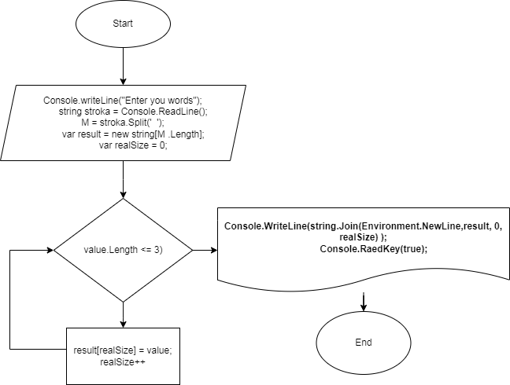

## Выполнение контрольной работы

**Задача:** *Написать программу, которая из имеющегося массива строк формирует новый массив из строк, длина которых меньше, либо равна 3 символам. Первоначальный массив можно ввести с клавиатуры, либо задать на старте выполнения алгоритма. При решении не рекомендуется пользоваться коллекциями, лучше обойтись исключительно массивами.*

# Решение задачи:
1. Берём массив
2. Проходимся по каждому элементу массива
3. Сравниваем массив со значением, в нашем случае равным 3
4. Результат записываем в переменную
5. Выводим результат на консоль